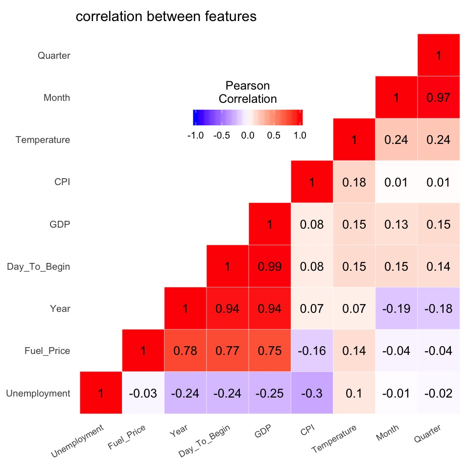
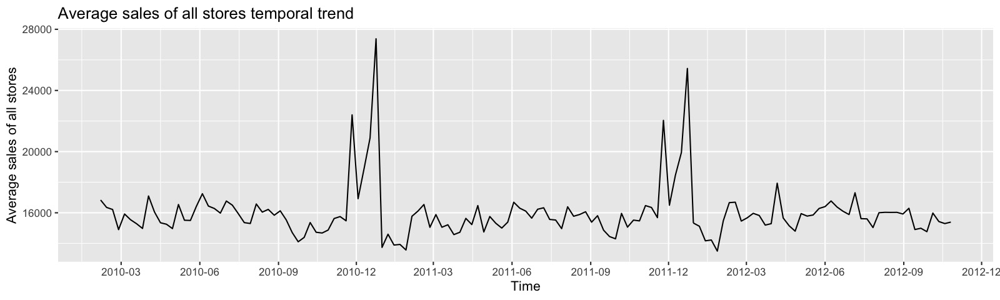



* * *

# Overview

## Background and motivation

Black Friday has been a famous sales promotion holiday around the country for over 60 years. While many people enjoy shopping for highly-discounted goods in the store during such precious family time, most sales managers are under great pressure, worrying about sales performance during this period. Such pressure comes not only in Black Friday, but also at each sales promotion time around the year, including Super Bowl, Labor Day, Christmas, etc. Many questions wait to be answered for these anxious sales managers: What are key factors that affect retail sales? How do they affect retail sales? With the knowledge of those key factors, how to get prepared for the future? 

Meanwhile, the booming e-commerce are making sales managers of leading offline retailers feel even more challenged, as both policy and strategy become different in the online shopping. Working in the high competitional retail industry, they are also eager to understand what are the differences between e-commerce and traditional offline retails. In order to help these sales managers of large retailers, we perform our retail statistical analysis in this project, trying to provide answers and recommendations to some questions they are often concerned about.

## Objective

As the weekly sales data we obtained are provided by Walmart, we sought to answer four primary questions for Walmart sales managers through this project.

* How social and economic factors affect retail sales?

* What are the key factors that affect retail sales?

* Can we develop a predictive algorithm integrating current features and sales information to predict retail sales in the near future? What form should that algorithm take?

* What are the differences between online and offline sales? Do they have different temporal patterns?

## Data

Dataset from multiple sources have been collected and combined for use in our analysis, including

* [Walmart weekly sales and store features data from Feb 5, 2010 to Oct 26, 2012](https://www.kaggle.com/c/walmart-recruiting-store-sales-forecasting/data)

* [US Gross Domestic Product (GDP) data](https://fred.stlouisfed.org/series/GDP)

* [US total retail sales and e-commerce retail sales from 4th quarter 1999 to 3rd quarter 2019](https://www.census.gov/retail/index.html)

## Approach

The type of questions we sought to answer suggest the analysis being separated into two subprojects: one (first three questions) focus on Walmart weekly sales, and the other one (the last question) focus on the general differences between e-commerce and traditional offline retails. These two subprojects together help not only answering specific questions with respect to certain features that Walmart sales managers may face everyday (for example, how does temperature reduce by one degree influence sales?), but also describing some broad new patterns of e-commerce for all sales managers in the approaching data science era.

(The following two paragraphs are a little bit technical, skip if you want) In the first subproject, we started by incomporating our interested features and sales data into an organized format, and performing some explorations to get first senses of relationship between features and sales as well as correlations between covariates before formal quantitative analysis. We next used some advanced statistical methods, such as stepwise regression and generalized estimating equations to extract key factors that have significant influences on sales outcome. The features collected, together with statistical knowledge informed the creation of three advanced predictive algorithms: one using selected generalized linear models, one using tree-based methods, and the other one using network-based methods.

In the second subproject, we modelled the temporal trend differences between e-commerce and offline sales by testing the significance of splines based on given pattern, and in further studied respective seasonal patterns. Some advanced statistical techniques, such as ANOVA test, are applied to quantify the results.

# Analysis

## Weekly sales pattern inference and prediction

### Exploratory data analysis

Many factors are potential to influence weekly sales of retailers, such as Unemployment rate, CPI, Temperature, Fuel price, Store size, etc. We explore the correlations between several temporal features (Unemployment rate, Fuel price, CPI, Temperature, GDP) and temporal variables with different scales (Year, Month, Quarter, Number of days since event begin). Some of features display strong correlations with temporal variables (Fuel price, GDP) while others do not (Unemployment rate, CPI, Temperature) from this crude correlation plots. As for relationship between features, we do not observe large dependence except between Fuel price and GDP, where time is inferred to be a confounder based on their respective strong temporal trend.



One important feature of Walmart weekly sales is that two peaks occurred at the end of each year, where the second one is always higher than the first one, corresponding with Christmas and Thanksgiving respectively. This pattern is not to our surprise, as stores usually offer the largest promotion events during that period, and the family time can usually stimulate the shopping passion. For other promotion events around a year, the sales pattern looks stable with slight fluctuations. One interesting finding is, the lowest sales usually comes two or three weeks directly after Christmas, possibly due to the reduced needs and passion after Christmas carnival.



Linking the sales outcome with each feature, 


## Temporal comparison of e-commerce and total sales


# Summary


Text can be **bold**, _italic_, or ~~strikethrough~~.

[Link to another page](./another-page.html).

There should be whitespace between paragraphs.

There should be whitespace between paragraphs. We recommend including a README, or a file with information about your project.

# Header 1

This is a normal paragraph following a header. GitHub is a code hosting platform for version control and collaboration. It lets you and others work together on projects from anywhere.

## Header 2

> This is a blockquote following a header.
>
> When something is important enough, you do it even if the odds are not in your favor.

### Header 3

```js
// Javascript code with syntax highlighting.
var fun = function lang(l) {
  dateformat.i18n = require('./lang/' + l)
  return true;
}
```

```ruby
# Ruby code with syntax highlighting
GitHubPages::Dependencies.gems.each do |gem, version|
  s.add_dependency(gem, "= #{version}")
end
```

#### Header 4

*   This is an unordered list following a header.
*   This is an unordered list following a header.
*   This is an unordered list following a header.

##### Header 5

1.  This is an ordered list following a header.
2.  This is an ordered list following a header.
3.  This is an ordered list following a header.

###### Header 6

| head1        | head two          | three |
|:-------------|:------------------|:------|
| ok           | good swedish fish | nice  |
| out of stock | good and plenty   | nice  |
| ok           | good `oreos`      | hmm   |
| ok           | good `zoute` drop | yumm  |

### There's a horizontal rule below this.

* * *

### Here is an unordered list:

*   Item foo
*   Item bar
*   Item baz
*   Item zip

### And an ordered list:

1.  Item one
1.  Item two
1.  Item three
1.  Item four

### And a nested list:

- level 1 item
  - level 2 item
  - level 2 item
    - level 3 item
    - level 3 item
- level 1 item
  - level 2 item
  - level 2 item
  - level 2 item
- level 1 item
  - level 2 item
  - level 2 item
- level 1 item

### Small image


### Large image


### Definition lists can be used with HTML syntax.

<dl>
<dt>Name</dt>
<dd>Godzilla</dd>
<dt>Born</dt>
<dd>1952</dd>
<dt>Birthplace</dt>
<dd>Japan</dd>
<dt>Color</dt>
<dd>Green</dd>
</dl>

```
Long, single-line code blocks should not wrap. They should horizontally scroll if they are too long. This line should be long enough to demonstrate this.
```

```
The final element.
```
