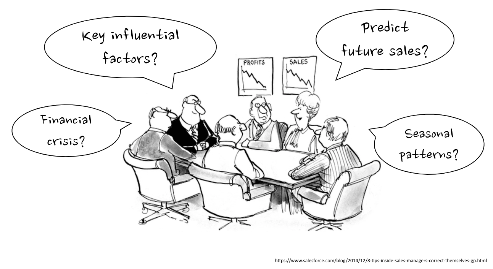
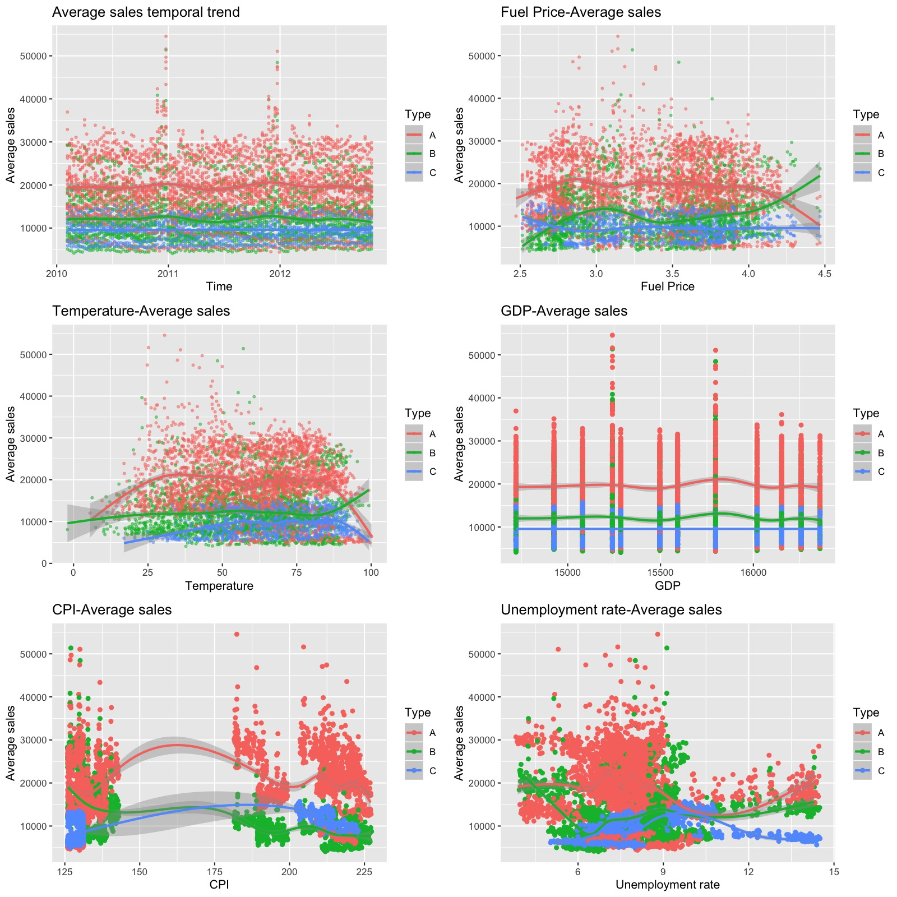
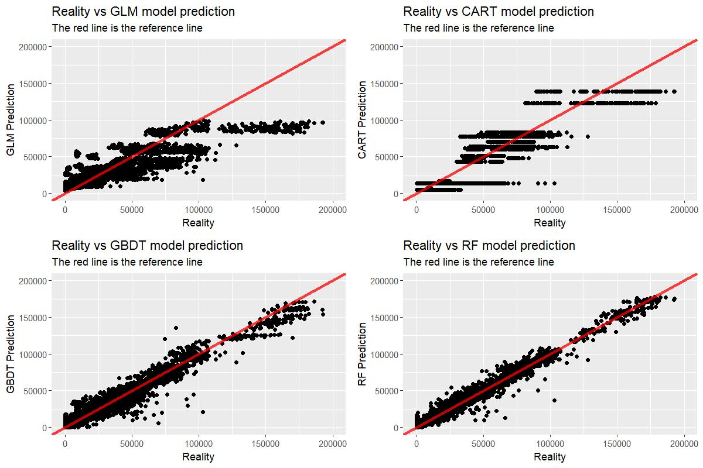
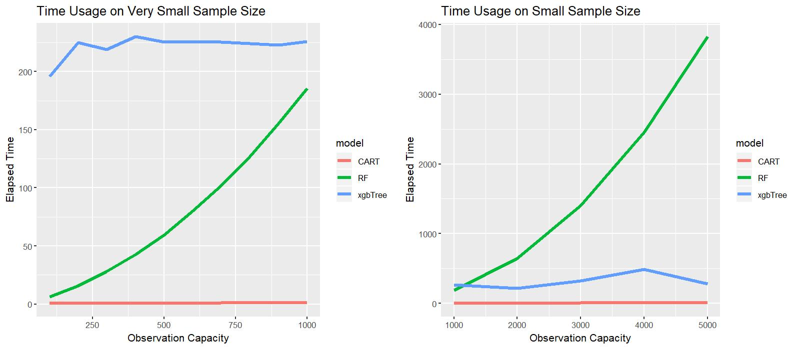
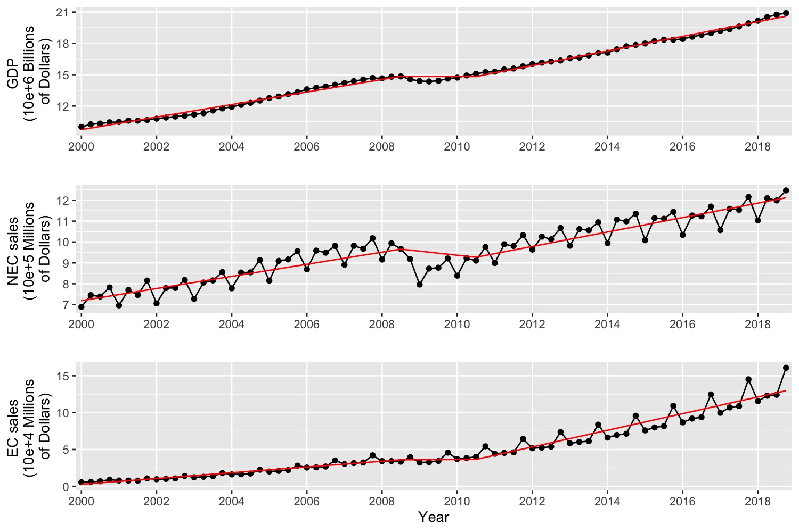
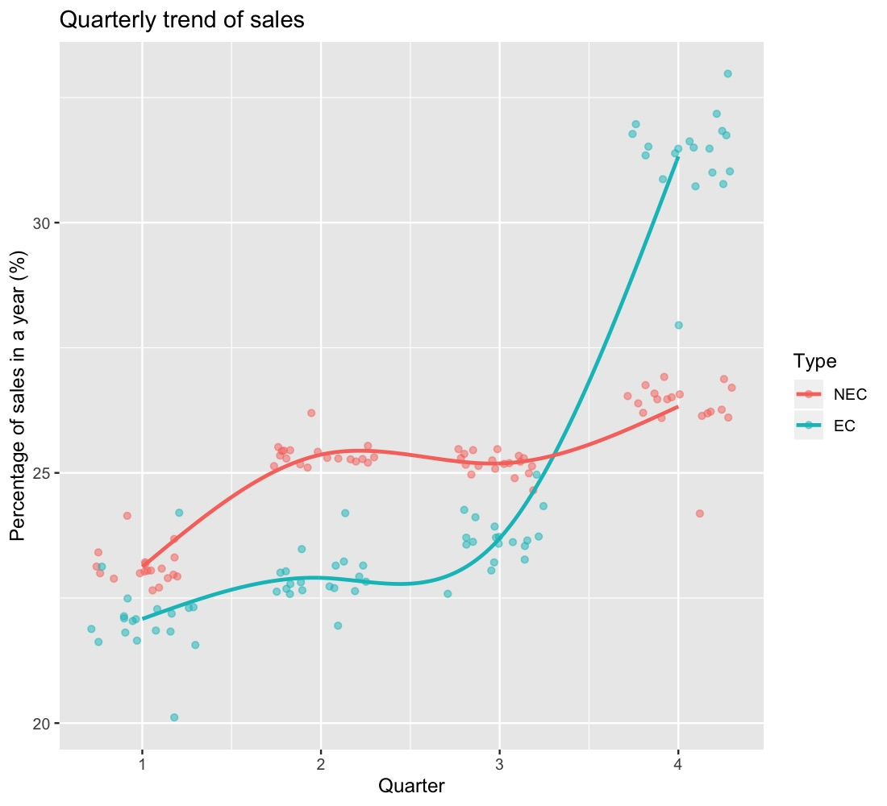



* * *

# Overview

## Background and motivation

As the world's largest economy by nominal GDP and net wealth, the United States has been famous for its prosperous retail industry over decades. Many retailers in the United States have earned their reputations all over the world, such as Walmart, Target, etc. Among all the job positions in the retailers, retail sales managers play a key role in the company, since such a competitive industry has been putting consecutively high expectations for them to adjust for rapid social innovation and keep the company's retail sales moving in the right direction. As sales managers, they are likely to be interested in not only getting prepared for the future sales, but also balancing the online and offline sales, as e-commerce concept is getting more and more popular in recent years. Many questions are arising from them every day: What are the factors that affect offline sales? Can we predict future sales? How do nationwide economic events affect the whole retail industry? What's new in this e-commerce era?

These hard problems from retail sales managers call for a more systematic and scientific approach to model different sales types with potential influential factors. Unfortunately, there has been a gap between the need of sales managers and retail sales data for a long time. To cover the gap, we conducted this data science project using retail sales data, trying to provide comprehensive advice for retail sales managers.

## Objective

Through this project, we sought to answer four primary questions for retail sales managers:

* What are the factors that affect offline sales?

* Can we integrate features with advanced statistical methods to predict retail sales in the near future?

* How do nationwide economic events affect the whole retail industry?

* What are different patterns of e-commerce compared with offline sales?

## Data

Dataset from multiple sources have been collected and combined for use in our analysis, including

* [Walmart retail sales and store features data from Feb 5, 2010 to Oct 26, 2012](https://www.kaggle.com/c/walmart-recruiting-store-sales-forecasting/data)

* [US total retail sales and e-commerce retail sales from 4th quarter 1999 to 3rd quarter 2019](https://www.census.gov/retail/index.html)

* [US Gross Domestic Product (GDP) data](https://fred.stlouisfed.org/series/GDP)

## Approach

The questions we sought to answer suggest the analysis being separated into two subprojects: one (first two questions) focus on Walmart retail sales and features, and the other one (the last two questions) focus on the general retail sales pattern in the United States. These two subprojects together help not only answering questions with respect to specific features that retail sales managers may be interested in (for example, would reducing temperature increase retail sales?), but also describing some general patterns of online and offline sales, serving as guidance for all retail sales managers in our approaching e-commerce world.

(The following two paragraphs are a little bit technical, skip if you want) In the first subproject, we started by exploring feature correlations and temporal distributions of retail sales individually, then exploring their joint relationship. Some advanced statistical methods are then applied, such as stepwise regression and generalized estimating equations, to extract key factors that have significant influences on sales outcome. The features collected, together with statistical knowledge of tree-based methods, informed the creation of three advanced tree-based predictive algorithms.

In the second subproject, we modelled the temporal trend differences between online and offline sales using splines, and quantified the effect of financial crisis in 2008 by testing the significance of spline coefficients. Their respective seasonal patterns were further analyzed through advanced statistical techniques, such as ANOVA test.

# Analysis

## Walmart retail sales inference and prediction

### Data visualization

Many factors may influence weekly sales of retailers, such as Unemployment rate, Consumer price index (CPI), Temperature, Fuel price, Store size, etc. We explore the correlations between several temporal features (Unemployment rate, Fuel price, CPI, Temperature, GDP) and temporal variables with different scales (Year, Month, Quarter, Number of days since baseline date). Some of features display strong correlations with temporal variables (Fuel price, GDP) while others do not (Unemployment rate, CPI, Temperature) from this crude correlation plots. As for relationship between features, we do not observe large dependence except between Fuel price and GDP, where time is inferred to be the underlying factor based on their respective strong temporal trend.

One important observation of retail sales are two peaks occurred at the end of each year, where the second one is always higher than the first one, corresponding with Christmas and Thanksgiving respectively. This pattern is not to our surprise, as stores usually offer the largest promotion events during that period, and the family time usually stimulate even more shopping passion. For other promotion events around a year, the sales pattern looks stable with slight fluctuations. One interesting finding is, the lowest sales usually comes two or three weeks directly after Christmas, possibly due to the reduced needs and passion after the Christmas carnival.

Linking retail sales with potential influential factors, the plots below illustrate the relationship between averages sales and each individual factor stratifying by store type. The definition of store types A, B, C is not mentioned from the data source, but we infer them to be Walmart Supercenter, Walmart Neighbourhood Market and Walmart Express stores respectively considering their size, amount and the [description](https://www.scrapehero.com/number-of-walmart-stores-and-an-analysis-of-related-store-data/) of Walmart store types before 2016. The plot implies weak linear effects of most features, but meanwhile indicates possible interactions with store type. For example, we observe a peak of average sales at the end of the year for type A and type B stores from the upper-left plot, but quite a flat temporal pattern for type C stores. However, the effects of some features look ambiguous, such as unemployment rate and temperature. 

The exploration work provides a general idea of how the features and weekly sales data look like. To identify "key" features and answer the first question, we next apply some advanced statistical models based on the visualization results.

### Key factors that influence weekly sales

We built several statistical models, including linear model with stepwise regression, generalized estimating equations, and generalized linear models. Technical parts are skipped here to keep our discussion on an appropriate level, and are discussed in detail in the report. We divide selected features into two categories with converse effects on retail sales:

**Positive effects**: Is Holiday indicator, CPI, Time, Temperature.

**Negative effects**: Unemployment rate, fuel price.

The effect of some key factors on weekly sales correspond well with our intuition. For example, unemployment rate tends to negatively influence weekly sales, as low umployment rate usually indicates strong economy. We further explored the type-specific effect and found a faster sales increase in type B stores than type A stores when unemployment rate drops. It is also interesting to find some features, with only vague ideas on how to influence retail sales, are selected as key factors, such as fuel price. Apart from multiple factors that can be related to retail sales, we indeed find an increase patterns of retail sales over time. 

### Prediction

The sales in certain periods display quite clear patterns, such as two peaks on Thanksgiving and Christmas, but look irregular at most time of a year. It has long been a challenging task for retailers to make precise prediction on future sales using existed information with so many factors (both temporal and spatial) to consider at the same time. We sought to improve the prediction performance using some advanced tree-based techniques, and compare prediction performance with traditional baseline methods (GLM). The charts below illustrate the tremendous increase of prediction performance using our model. 

The computing time of three tree-based prediction models are compared under different sample sizes. It is interesting to observe an exponential running time of random forest, which makes it dramatically slower with large sample size. Meanwhile, the running speed of the other two models (CART and GBDT) looks pretty stable across different sample sizes. 

In summary, we found the Random Forest perform best in accuracy, but its usage time increase exponentially. The Gradient Boosted Decision Tree method would be a reasonable substitute for the efficient problem of RF.

## US retail sales pattern

E-commerce has become more and more popular all over the world. The sales chain is often shorter by skipping the onsite stores step, and the promotion stategy can be slightly different under such new sales pattern by focusing on shipping discount of online purchase. For retail sales managers and many other people who are interested in e-commerce, it is good to first have a look at its new features under the framework of general US retail sales.

### Financial crisis influence

The chart below describe the temporal trend of both online and offline sales in the United States from 2000 to 2018, as well as the GDP during this time. During the notable financial crisis period around 2008, we observe a drop of both GDP and offline sales, but the online sales remained steady. Such different patterns were modeled and confirmed through spline coefficients, suggesting higher robustness of e-commerce during financial crisis, which might come from its more flexible operating mode.

### Seasonal fluctuation

The seasonal fluctuation of online and offline sales also displays different patterns from the above charts, with apparent low offline sales in the 1st quarter and high online sales in the 4th quarter. We extract and describe such seasonal pattern by summarizing their respective percentage of sales by quarter for each year. The large proportion of e-commerce sales in the last quarter of a year may be attributed to large sales promotion events during this time, together with cold weather and other possible factors. For the retailers that are recently transforming to e-commerce business, such yearly pattern suggests the modification of storage plan over time.

# Summary

