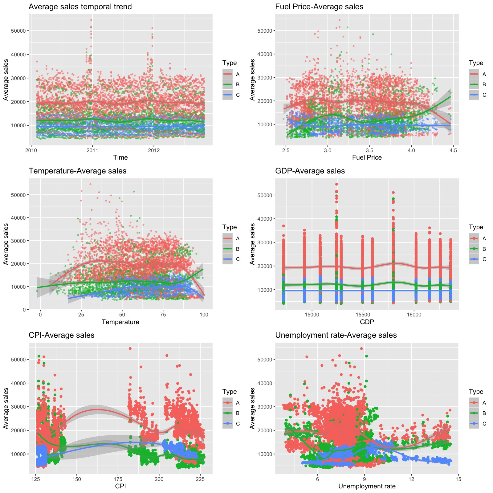
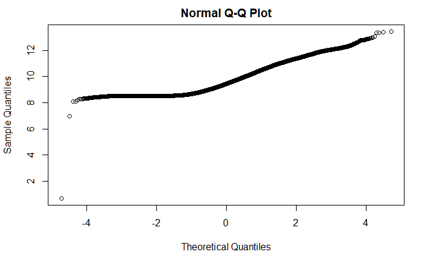
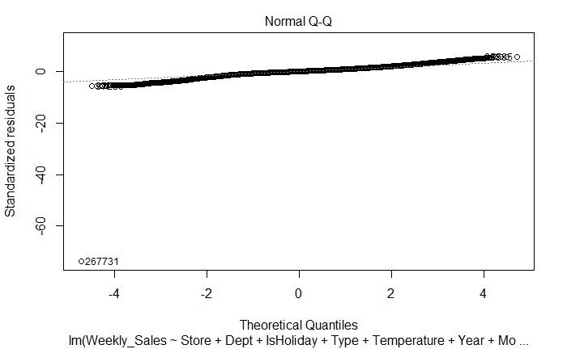
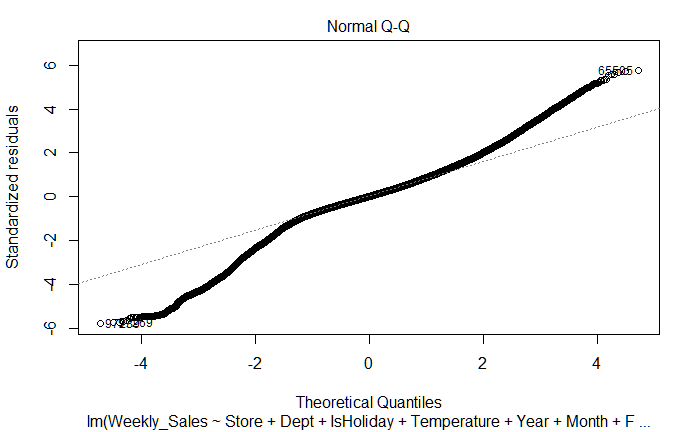

```{r setup, include=FALSE}
knitr::opts_chunk$set(echo = TRUE)
```

**Attention**: The data have been uploaded into our github [project reposotory](https://github.com/churchillcui/ads_retail), together with some intermediate results (some model fitting results and plots that are time-consuming). Some of the intermediate results are a little bit large (around 200 MB). The aim is to accelerate the knit speed of this .rmd file. You should be able to finish the knit process within 5 minutes after downloading all files in this branch of repository. The website construction files are in the other branch "gh-pages". 

The project website: https://churchillcui.github.io/ads_retail/

The project screencast: https://www.youtube.com/watch?v=__oHjvxeCI4

# Overview

## Background and Motivation

As the world’s largest economy by nominal GDP and net wealth, the United States has been famous for its prosperous retail industry over decades. Many retailers in the United States have earned their reputations all over the world, such as Walmart, Target, etc. Among all the job positions in the large retailers, sales managers play a key role in the company, since such a competitive industry has been putting consecutively high expectations for them to adjust for rapid social innovation and keep the company’s retail sales moving in the right direction. As sales managers, they are likely to be interested in not only getting prepared for the future sales, but also balancing the online and offline sales, as e-commerce concept is getting more and more popular in recent years. Many questions are arising from them every day: What are the factors that affect sales? Can we predict future sales? How do nationwide economic events influence the whole retail industry? What’s new in this e-commerce era?

These hard problems from retail sales managers call for a more systematic and scientific approach to model different sales types with potential influential factors. Unfortunately, there has long been a gap between the need for sales managers and retail sales data. As discussed in this [article](https://www.vendhq.com/2018-retail-trends-predictions) talking about retail trends and predictions for 2018, data will (and should) drive retail decisions more than ever. To cover such a gap, we conducted this data science project using retail sales data, trying to provide comprehensive advice for retail sales managers. 

## Objective

Through this project, we sought to answer four primary questions for retail sales managers, specified as the **target audience** of our project:

* What are the factors that affect the offline sales? 

*	How to predict future offline sales?

*	How do nationwide economic events affect the whole retail industry?

*	What are the different patterns of online sales compared with offline sales?

## Approach

The questions we sought to answer suggest the analysis being separated into two subprojects: one (first two questions) focus on Walmart retail sales and related features, and the other one (the last two questions) focus on the general retail sales pattern in the United States. These two subprojects together help not only answering questions with respect to specific features that retail sales managers may be interested in (for example, would reducing temperature increase retail sales?), but also describing some general patterns of online and offline sales, serving as guidance for all retail sales managers in our arrived e-commerce world.

In the first subproject, we started by exploring feature correlations and temporal distributions of retail sales individually, then exploring their joint relationship. Some advanced statistical methods are then applied, including linear model with stepwise regression, generalized estimating equations, and generalized linear models, to extract key factors that have significant influences on sales outcome. The features collected, together with statistical knowledge of tree-based methods, informed the creation of three advanced tree-based predictive algorithms. We then compared the prediction accuracy and time usage between these tree-based models and traditional statistical baseline model (GLM in our case) to provide some summarized suggestions for sales managers.

In the second subproject, we modeled the temporal trend differences between online and offline sales using splines, and quantified the effect of financial crisis in 2008 by testing the significance of spline coefficients. Their respective seasonal patterns were further analyzed through advanced statistical techniques, such as F test.

## Data

Multiple data sources have been extracted and summarized as spreadsheets and organized in our project. Considering the target audience as retail sales managers, we aimed at exploring and studying possible retail sales data with related factors from different sources. 

In preparation for the first subproject, we sought to find open sales data from large retailers such as Walmart. Our first attempt was to obtain sales data from the Walmart website. Some summarized financial information are available on the website, such as the 13-week period 4-5-4 [comparable store sales](https://stock.walmart.com/investors/financial-information/comparable-store-sales/default.aspx) of each fiscal year. However, the detailed sales data seems unavailable for public use. Therefore, we turned to look for some other sources on the Internet. We found Walmart's net sales worldwide from 2006 to 2019 on the [Statista](https://www.statista.com/statistics/183399/walmarts-net-sales-worldwide-since-2006/). However, the scale was too vague (worldwide overall sales) to perform detailed analysis. Fortunately, we found that Walmart shared a [dataset](https://www.kaggle.com/c/walmart-recruiting-store-sales-forecasting/data) in 2013 through kaggle, which contains the actual historical sales data for 45 selected Walmart stores in the United Stores. Although this dataset only contains limited information about Walmart sales and is not complete, it helped as a good place to start, covering information about both sales and many store features.

To have a close look at the dataset, five .csv files are provided in total, named as "features.csv", "sampleSubmission.csv", "stores.csv", "test.csv" and "train.csv" respectively. As the goal of our first subproject is not to finish the competition on kaggle, but to have a comprehensive analysis of retail sales, we focus on three data frames of them: "features.csv", "stores.csv", and "train.csv". The rest two files are only for competition submission purpose. 

"features.csv" contains some temporal features of each store with 8191 rows and 12 columns. The features include the store number (Store), the week (Date), average temperature in the region (Temperature), cost of fuel in the region (Fuel_Price), anonymized markdown data (MarkDown1-5), Consumer Price Index (CPI), the unemployment rate (Unemployment), and whether the week is a special event week (IsHoliday). The special events refer to Super Bowl, Labor Day, Thanksgiving and Christmas every year. "stores.csv" contains non-temporal features of stores with 45 rows and 3 columns, including the number (Store), type (Type) and size (Size) of the store. "train.csv" contains the historical weekly sales of each department at each store with 421570 rows and 5 columns, ranging from February 5, 2010, to November 1, 2012. 

Although the data provide historical sales data of Walmart together with some temporal and non-temporal features, we discover some limitations of this dataset. Several other external sources are pursued to handle some of them, illustrated in the next paragraph, while some remained unsolvable in our analysis. For example, the location of each store is anonymized, which hampers the adjustment of retail sales based on local sociodemographic factors such as the population. Meanwhile, the anonymized markdown data making itself hard to use in the analysis, and we also observe a large amount of missing data in this markdown feature in the exploration. As a result, we decide not to use these markdown data in our project, as no inference could be drawn with only some vague explanations from data provider.

To study the characteristics of online and offline retail sales, we obtained the [retail sales data](https://www.census.gov/retail/index.html) in the United States from 4th quarter 1999 to 3rd quarter 2019, originally provided by the US Census Bureau. Estimates are based on data from the Monthly Retail Trade Survey and administrative records. In this dataset, E-commerce sales are sales of goods and services where an order is placed by the buyer or price and terms of sales are negotiated over an online system. We assumed the E-commerce retail sales in this dataset can represent the online sales, and the non-E-commerce (the difference of total retail sales and E-commerce retail sales) can represent the offline sales. 

To consider other potential factors, we referred to some articles online and found this [article](https://smallbizclub.com/sales-and-marketing/sales-marketing-activities/5-important-variables-affect-retail-business-success/) discussed five important variables that affect retail business success. Apart from the competition and technology underlined with online shopping, the general economic status was mentioned as another factor that related to retail sales. Based on this suggestion, we also include the [GDP data](https://fred.stlouisfed.org/series/GDP) of the United States in the model. As the politics and consumer trend factors are hard to infer from current data, we leave them for future research extension.

With multiple data sources, we managed to combine and re-organize them into analyzable form via standard tidying and wrangling process.

# Analysis

## Walmart retail sales inference and prediction

### Data wrangling and tidying

We first loaded some R packages used in the project.

```{r message=FALSE, warning=FALSE}
library(tidyverse)
library(splines)
library(caret)
library(readxl)
library(lubridate)
library(doMC)
library(xgboost)
library(randomForest)
library(neuralnet)
library(gee)
library(MASS)
library(scales)
library(ggpubr)
library(reshape2)
library(stringr)
library(readr)
library(ggplot2)
library(gridExtra)
```

Next, we read the .csv files discussed in the previous section.

```{r message=FALSE}
## weekly sales of each department of each store
train <- read_csv("./Data/train.csv")

## temporal features of each store
features <- read_csv("./Data/features.csv")

## type and size information of each store
stores <- read_csv("./Data/stores.csv")
```

Although the `read_csv` function from the `readr` package will automatically convert .csv files into tibbles, some default convert format are not appropriate. Thus, we modified some columns to the desired format.

```{r}
## weekly sales data
train$Store <- as.factor(train$Store)
train$Dept <- as.factor(train$Dept)

## temporal feature data
features$Store <- as.factor(features$Store)

## store information data
stores$Store <- as.factor(stores$Store)
stores$Type <- as.factor(stores$Type)
```

As mentioned in the data section, we used some external sources to build the data frame for the formal analysis, though the data in our second subproject are analyzed relatively independently with different time intervals. Note that those data have already been extracted or re-organized into .csv or .xlsx file before loading to R.

```{r, warning=FALSE, message=FALSE}
## read GDP data
GDP <- read_csv("./Data/GDP.csv")
```

The GDP is considered as one of the important variables that affects retail sales. Temporal indicators, including year and quarter, are also added.

```{r}
## economy status data
GDP$Year <- c(rep(2010, 4), rep(2011, 4), rep(2012, 4), rep(2013,3))
GDP$Quarter <- c(c(1,2,3,4), c(1,2,3,4), c(1,2,3,4), c(1,2,3))
```

After finishing cleaning each separate data, we next combined them into one data frame, recording the features and sales of each department of each store at each time.

```{r, warning=FALSE, message=FALSE}
## combine and re-organize data from multiple sources
### combine weekly sales and store information
data_combined <- left_join(train, stores, key = "Store")

### combine temporal features of store
data_combined <- unite(data_combined, "Store-Date", c("Store", "Date"), sep = "-", remove = FALSE)
feature_temp <- unite(features, "Store-Date", c("Store", "Date"), sep = "-", remove = FALSE)
data_combined <- left_join(data_combined, feature_temp, key = "Store-Date")

### combine economy status information
data_combined$Year <- year(data_combined$Date)
data_combined$Quarter <- quarter(data_combined$Date)
GDP$DATE <- NULL
data_combined <- left_join(data_combined, GDP, by = c("Year", "Quarter"))
```

Since the temporal trend is a very important factor that may affect offline retail sales, we next included some more time indicators with different scales. Some of them (Year, Quarter) have been added in the previous tidying process. As some of them are highly correlated, we later performed forward and backward selections in the model phase, described in detail in the inference section.

```{r}
## include some temporal variables with different scales
data_combined$Month <- month(data_combined$Date)
data_combined$Day <- day(data_combined$Date)
### set Jan 1, 2010 as the baseline, we include the days of each record to baseline, named as Day_To_Begin
data_combined$Day_To_Begin <- as.numeric(data_combined$Date - as.Date("2010-01-01"))
```

After combining datasets from multiple resources to one data frame, we performed some further clean work on this data frame by removing columns that could not be well interpreted due to data limitation (e.g. anonymized markdown data) or that used only for data integration purpose (e.g. "Store-Date"). The cleaned data frame is then renamed as `data_analysis` and is leveraged along the rest of our project.

Note that we did not include online sales data in the inference and prediction of the first subproject, but instead left them for the second subproject. The reason is that, it is not the total sales that influence retail sales, but the retail sales in Walmart is a component of total sales. As a result, the unknown population information due to location anonymization will lead to great bias. 

```{r}
data_analysis <- data_combined[,c(2:10, 16:23)]
```

After our data tidying and wrangling process, the integrated data frame `data_analysis` has 421570 rows and 17 columns.

## Exploratory data analysis
   
In the exploratory data analysis part, we explored the temporal trend of different covariates and possible interactions between these covariates using tidied data.   

### Heatmap of correlation between covariates
The potential covariates that may influence the weekly sales are time information, CPI, GDP, temperature, unemployment rate, fuel price, type and size of the store. First we looked at the correlation heatmap of these covariates to see if there is any dependence among these covariates.

```{r}
# select potential covariates 
data.heatmap <- data_analysis[,c("Temperature", "CPI", "GDP", "Unemployment", "Fuel_Price", "Year" ,"Month", "Day_To_Begin","Quarter")]
# change day difference format
data.heatmap$Day_To_Begin <- as.numeric(data.heatmap$Day_To_Begin)
# get corrlation matrix
cormat <- round(cor(data.heatmap), 2)
reorder_cormat <- function(cormat){
# use correlation between variables as distance
    dd <- as.dist((1-cormat)/2)
    hc <- hclust(dd)
    cormat <- cormat[hc$order, hc$order]
}
get_upper_tri <- function(cormat){
# get upper triangle matrix
    cormat[lower.tri(cormat)]<- NA
    return(cormat)
}
cormat <- reorder_cormat(cormat)
upper_tri <- get_upper_tri(cormat)
melted_cormat <- melt(upper_tri, na.rm=T)
# plot the correlation
ggplot(melted_cormat, aes(Var2, Var1, fill = value))+
 geom_tile(color = "white")+
 scale_fill_gradient2(low = "blue", high = "red", mid = "white", 
   midpoint = 0, limit = c(-1,1), space = "Lab", 
    name="Pearson\nCorrelation") +
  theme_minimal() + # minimal theme
 theme(axis.text.x = element_text(angle = 45, vjust = 1, 
    size = 12, hjust = 1)) +
 coord_fixed() +
  geom_text(aes(Var2, Var1, label = value), color = "black", size = 4) +
theme(
  axis.title.x = element_blank(),
  axis.title.y = element_blank(),
  panel.grid.major = element_blank(),
  panel.border = element_blank(),
  panel.background = element_blank(),
  axis.ticks = element_blank(),
  legend.justification = c(1, 0),
  legend.position = c(0.6, 0.7),
  legend.direction = "horizontal")+
  guides(fill = guide_colorbar(barwidth = 7, barheight = 1,
                title.position = "top", title.hjust = 0.5))
```
   
From the heatmap, we observed that there is almost no dependence among these covariates, which is good for the use of our linear model and generalized linear model.      

### Weekly sales
First we looked at average sales of all 45 stores. We summarised the data by calculating average weekly sales in these three years and plot the temporal trend.   

```{r}
# summarise average sales
dat.avg.store <- data_analysis %>%
  group_by(Date) %>%
  summarise(sales=mean(Weekly_Sales))

# time - average sales plot
ggplot(data=dat.avg.store, aes(x=Date, y=sales))+
  geom_line()+
  labs(x="Time",y="Average sales of all stores",title="Average sales of all stores temporal trend")+
  scale_x_date(date_breaks = "3 month",labels = date_format("%Y-%m"))

```
   
As we can see, the average sales have some small fluctuations in the first ten months of each year and have a outburst at the end of each year. This is possibly because of Thanksgiving and Christmas holidays.   

Then we looked at averages sales in each store separately. We summarised the data by calculating the average sales across different department in each store in these three years. Then we looked at the relationship between average sales and different covariates, like temperature, CPI, GDP, Unemployment rate, fuel price. We stratified the store by type to visualize the relationship since type is also a potential covariate.   

```{r}
# summarise average sales in each store
dat.ave <- data_analysis %>%
  group_by(Store, Date, Type, IsHoliday, Fuel_Price, CPI, GDP, Unemployment, Temperature) %>%
  summarise(avesales = mean(Weekly_Sales))
```

```{r eval=FALSE}
# time - average sales plot stratified by type
p1 <- ggplot(data = dat.ave, aes(x = Date, y = avesales, color = Type)) + 
  geom_point(size = .8, alpha = 0.5) + 
  geom_smooth() +
  labs(x = "Time", y = "Average sales", title = "Average sales temporal trend")

# fuel price - average sales plot stratified by type
p2 <- ggplot(data = dat.ave, aes(x = Fuel_Price, y = avesales, color = Type)) + 
  geom_point(size = .8, alpha = 0.5) +
  geom_smooth() +
  labs(x = "Fuel Price", y = "Average sales", title = "Fuel Price-Average sales")

# temperature - average sales plot stratified by type
p3 <- ggplot(data = dat.ave, aes(x = Temperature, y = avesales, color = Type)) + 
  geom_point(size = .8, alpha = 0.5) +
  geom_smooth() +
  labs(x = "Temperature", y = "Average sales", title = "Temperature-Average sales")

# GDP - average sales plot stratified by type
p4 <- ggplot(data = dat.ave, aes(x = GDP, y = avesales, color = Type)) + 
  geom_jitter(position = position_jitter(0.2)) +
  geom_smooth() +
  labs(x = "GDP", y = "Average sales", title = "GDP-Average sales")

# CPI - average sales plot stratified by type
p5 <- ggplot(data = dat.ave, aes(x = CPI, y = avesales, color = Type))+
  geom_jitter(position = position_jitter(0.2)) +
  geom_smooth() +
  labs(x = "CPI", y = "Average sales", title = "CPI-Average sales")

# unemployment rate - average sales plot stratified by type
p6 <- ggplot(data = dat.ave, aes(x = Unemployment, y = avesales, color = Type)) + 
  geom_jitter(position = position_jitter(0.2)) + 
  geom_smooth() +
  labs(x = "Unemployment rate", y = "Average sales", title = "Unemployment rate-Average sales")

ggarrange(p1, p2, p3, p4, p5, p6, nrow = 3, ncol = 2)
```
   

   
From these plots, we can observe that type has interactions with these covariates (time, temperature, CPI, GDP, fuel price, unemployment rate). Therefore it is reasonable to include these interactions in our model. However, some interactions may not be linear.   
    
```{r}
# type - average sales plot stratified by isholiday indicator
ggplot(data = dat.ave)+ 
  geom_boxplot(aes(x = Type, y = log(avesales), color = IsHoliday)) +
  labs(x = "Type", y = "Average sales", title = "Boxplot of type-sales")
```

From this plot we can note that holiday effect exists in Type A and Type B stores. The difference is not very significant in Type C stores.   

## Model fitting and inference

### Linear model and stepwise regression
First, we constructed a linear model to capture the features in the dataset. There are many covariates, such as store ID, type and size of the store, department, time information, holiday indicator, CPI, GDP, unemployment rate, fuel price, and temperature. To capture the time information, we first broke the date into the year, month information separately.   

```{r}
# Q-Q plot for response
data.fit <- data_analysis
# make response positive
data.fit$Weekly_Sales <- data.fit$Weekly_Sales + abs(min(data.fit$Weekly_Sales)) + 2
data.fit$Month <- factor(data.fit$Month)
```

First, we adjusted the response to all be positive. Then we tool a logarithm transformation to downsize the sales.   

```{r eval = FALSE}
# Q - Q plot for sales
qqnorm(log(data.fit$Weekly_Sales))
```



From the Q-Q  (Quantile-Quantile) plot, we can see that the logarithm of adjusted weekly sales are not normally (Gaussian) distributed. Therefore, we decided to make adjustments on the dataset before we get started to use multiple statistical models.

We used box cox transformation to rewrite the data, making the normality more significant. 

The covariates in the model include store ID, department, holiday indicator, type and size of the store, year, month, fuel price, temperature, CPI, unemployment rate, GDP, and the interaction term between type and time, fuel price, temperature, CPI, unemployment rate, GDP.   

```{r eval=FALSE}
# box cox transformation
boxcox <- boxcox(data = data.fit,log(Weekly_Sales) ~ Store + Dept + IsHoliday + Type + Size 
                 + Temperature + Year + Month + Fuel_Price 
                 + CPI + Unemployment + GDP 
      + Type:Temperature + Type:Fuel_Price + Type:CPI + Type:Unemployment + Type: GDP
      + Type:Year + Type:Month + Type:Day_To_Begin + Type:Quarter)
# select best parameter to do box cox transformation
lambda <- boxcox$x # lambda values
lik <- boxcox$y # log likelihood values for SSE
bc <- cbind(lambda, lik) # combine lambda and lik
sorted_bc <- bc[order(-lik),] # values are sorted to identify the lambda value for the maximum log likelihood for obtaining minimum SSE
head(sorted_bc, n = 10)
```

```{r echo=FALSE}
# write.csv(sorted_bc, "boxcox.csv")
boxcox=read.csv("./Intermediate/boxcox.csv")
boxcox[1:10,]
```
   
From the result, we can see that the parameter in the box cox transformation should be -0.10101010. Therefore, we rewrote the response using box cox transformation and fit the linear regression model. After doing this, we used stepwise regression (both backward and forward selection) to pick the best model (minimizing AIC).  

```{r eval=FALSE}
# transform response variable
data.fit$Weekly_Sales <- (log(data.fit$Weekly_Sales)^(-0.10101010) - 1)/(-0.10101010)
# full model
full.model <- lm(data = data.fit, Weekly_Sales ~ Store + Dept + IsHoliday + Type + Size 
                 + Temperature + Year + Month + Fuel_Price 
                 + CPI + Unemployment + GDP 
      + Type:Temperature + Type:Fuel_Price + Type:CPI + Type:Unemployment + Type: GDP
      + Type:Year + Type:Month + Type:Day_To_Begin + Type:Quarter)
# stepwise regression
step.model <- stepAIC(full.model, direction = "both", trace = FALSE)
```
   
However, when we checked the model and plot the Q-Q plot for the residuals, we found an outlier in this dataset.   

```{r eval=FALSE}
plot(step.model)
```
   

   
Therefore we deleted the outlier in the dataset, and used selected covariates to refit the linear model as below.   
   
```{r eval=FALSE}
# use the selected model and delete the outlier
final.model <- lm(data=data.fit[-267731,], Weekly_Sales ~ Store + Dept + IsHoliday + Temperature + Year + Month + Fuel_Price + CPI + Unemployment
      + Type:CPI + Type:Unemployment
      + Type:Year + Type:Month + Type:Day_To_Begin)
```
   
Again, we checked the residual plot and found that the residuals are not following the normality assumption. Therefore, the linear model does not capture the data features well, and we would need to turn to other models.   

```{r eval=FALSE}
plot(final.model)
```
   

   
### Generalized Estimating Equations
First, we calculated the summation of sales across different departments within a store on a given day. Then we treated each stores' sales data as longitudinal observations and use generalized estimating equations to fit the model. The covariates are those we selected in the linear model, and the working correlation structure is set to be `corstr = "exchangeable"` since we assumed sales is correlated between different days.  

```{r message=FALSE, warning=FALSE, results="hide"}
# get summarised data for gee
model_gee <- data_analysis %>% group_by(Store, Year, Month, GDP, Day, Quarter, Day_To_Begin, IsHoliday, Type, Temperature, Fuel_Price, CPI, Unemployment) %>% summarise(sales = sum(Weekly_Sales))
model_gee$Month <- factor(model_gee$Month)

gee.model1 <- gee(log(sales) ~ Store + IsHoliday + Temperature + Year + Month + Fuel_Price + CPI + Unemployment
      + Type:CPI + Type:Unemployment
      + Type:Year + Type:Month + Type:Day_To_Begin,
      id = factor(Store), data = model_gee, corstr = "exchangeable")
```

```{r}
seq=seq(1,45,1)
summary(gee.model1)$coefficients[-seq,1]
```

We will interpret the model result together with GLM model introduced below.
   
### Generalized linear model Using Quasi-Likelihood
Our last model is generalized linear model using quasi-likelihood. First we observed that   

```{r}
c(mean(data_analysis$Weekly_Sales), var(data_analysis$Weekly_Sales))
```
   
The variance is nearly the square of the mean. Therefore we used quasi-likelihood in which variance is $\mu^2$, and took log-link to downsize the sales data. The covariates are those selected using stepwise regression. The covariates and the link function were selected so that the model does not have a very large or very small residual deviance, making the model more convincing.   

```{r eval=FALSE}
data.fit2 <- data_analysis
# make response positive
data.fit2$Weekly_Sales <- data.fit2$Weekly_Sales + abs(min(data.fit2$Weekly_Sales)) + 2
data.fit2$Month <- factor(data.fit2$Month)
# GLM using quasi likelihood
glm.model <- glm(data=data.fit2, Weekly_Sales ~ Store + Dept + IsHoliday + Temperature + Year + Month + Fuel_Price + CPI + Unemployment
      + Type:CPI + Type:Unemployment
      + Type:Year + Type:Month + Type:Day_To_Begin,
      family = quasi(link = "log", variance = "mu^2"))
```

```{r echo=FALSE}
# saveRDS(glm.model, "glm.rda")
glm.model <- readRDS("./Intermediate/glm.rda")
```

```{r}
seq=seq(1,145,1)
summary(glm.model)$coefficients[-seq,]
```
   
The definition of store types A, B, C is not mentioned from the data source, but we inferred them to be Walmart Supercenter, Walmart Neighbourhood Market and Walmart Express stores respectively considering their size, amount and the description of Walmart store types before 2016.   

Model interpretation:   
   
* The estimated coefficient for holiday indicator is 2.305e-02, with a p-value less than 2e-16, which suggests that holidays like Thanksgiving and Christmas indeed promote the sales and the holiday effect is statically significant. Same result is also observed in GEE model.   

* The estimated coefficient for temperature is 7.992e-04, with a p-value 1.96e-12, which indicates that temperature correlates with sales positively. When the temperature goes down, people may not want to go out and shop in retail stores since it is too cold. Same result is also observed in GEE model.      

* The estimated coefficient for fuel price is -6.997e-03, with a p-value 0.02, which says that upgoing fuel price also reduces sales, and the effect is statistically significant. Our proposed reason is that when fuel price goes up, people may not want to drive to retail stores to go shopping. Same result is also observed in GEE model.      

* The estimated coefficient for CPI is 2.198e-03, with a p-value 0.001, which suggests that CPI is also positively correlated with sales and this makes perfect sense. This result is supported by the data with statistical significance. Same result is also observed in GEE model.   

* The estimated coefficient for the unemployment rate is -1.539e-02, with a p-value 1.16e-15, which means that the unemployment rate is negatively correlated with sales. This result has statistical significance. The reason for such a phenomenon is that when the unemployment rate goes up, people may not have enough money to shop in retail stores. Same result is also observed in GEE model.      

* The estimated coefficient for Year is 2.671e-01, with a p-value 2.26e-14, which indicates that weekly sales is increasing over these years. The result is also statistically significant. Same result is also observed in GEE model.      

* The estimated coefficient for month indicator has the largest value in November and December, which makes perfect sense since Thanksgiving and Christmas holidays are in these two months and the sales have a outburst during these holidays. Same result is also observed in GEE model.      

* Comparing with type A store (supercenter), holding other covariates the same, when CPI goes up, all stores' weekly sales will go up. However, type B stores' (neighborhood market) weekly sales have larger increase speed while type C stores' (Express) weekly sales decrease more slowly. Same result is also observed in GEE model.      

* Comparing with type A store (supercenter), holding other covariates the same, when unemployment rate goes up, all stores' weekly sales will go down. However, type B stores' (neighborhood market) weekly sales decrease faster while type C stores' weekly sales have a less decreasing speed. While in GEE model, type B (neighborhood market) and type C (Express) stores' weekly sales both have a less decreasing speed compared with type A stores.      

* Comparing with type A store (supercenter), holding other covariates the same, as time goes, all stores' weekly sales will go up. However, type B stores' (neighborhood market) weekly sales have a slower increasing speed while type C (Express) stores' weekly sales have a faster uprising speed. Same result is also observed in GEE model.    

To sum up, we divide the covariates into "helpers" and "suppressors":   
Positively correlated with weekly sales (helpers): Is Holiday indicator, CPI, Time, Temperature   
Negatively correlated with weekly sales (suppressors): Unemployment rate, fuel price   

**Potential limitations**: The residual deviance is 62,400 on 421,433 degrees of freedom. Even though there may be a problem of overfitting, but we use quasi-likelihood to make a control and the model is convincing. What's more, we only consider linear interactions but there may be some nonlinear interactions between covariates.     

Advice for sales manager in Walmart:

* Holiday effect is statistically siginificant. Therefore, stores can host some sales promotion activities on national holidays to increase their profit.

* It helps to make more promotion activities in the first quarter to attract customers.   

## Predictive algorithm

We first partitioned the data into training and testing set. In application, we are more interested in predicting the weekly sales in a certain period. As a result, we introduced `p` as the percentage of training data, and used the first p percent of the days as the training data and the rest as test data.

```{r}
## partition into train and test data
p <- 0.8
data_train <- data_analysis[which(data_analysis$Day_To_Begin <= quantile(data_analysis$Day_To_Begin, p)),]
data_test <- data_analysis[which(data_analysis$Day_To_Begin > quantile(data_analysis$Day_To_Begin, p)),]
```

We chose to try parallel computing, which had been covered in our course lectures, to reduce the time consumption of our machine learning methods.

```{r}
## parallel computing
registerDoMC(4)
```

Given that we have discussed Tree-related classification methods intensively in our Advanced Data Science course on several sample questions, we are curious about the preformance of Tree-related machine learning methods in answering regression (rather than classification) questions. 

Our exploration of Tree-related regression methods began with the Classification and Regression Tree (CART) algorithm. This method is the most primitive machine learning method applying decision trees. In the `caret` package, we used `method = rpart1SE` to realize this method.

The four major reasons of using CART:

* The CART model is simple that could be explained by a tree structure.

* The time usage of CART model is very low even on large samples, which means that the method is convenient.

* We have learned the structure of CART in our courses and we hope to find their application in real questions.

* The CART model serves as the benchmark of all the three Tree-related machine learning methods we practiced. We would expect that more elaborated machine learning methods would give a better prediction performance than the CART model.

Since the random forest (RF) algorithm that we were going to implement later was very slow and took a very long time to generate a prediction result, we used the first 50000 observations in our training dataset for all the machine learning methods to make it fair in performance evaluation.

```{r, eval = FALSE}
## train the model using proposed machine learning methods
### xgbTree
#### training
ptm <- proc.time()
fit.CART <- train(Weekly_Sales ~ ., data = data_train[1:50000,], method = "rpart1SE", 
               trControl = trainControl("cv", number = 10))
proc.time() - ptm
#### prediction
pred.CART <- predict(fit.CART, newdata = data_test)

# save(pred.CART, file = "pred.CART.rda")
```

The second machine learning method we propose is the Gradient Boosting Decision Tree (GBDT) algorithm. This method is built on the fundament of Decision Trees. There are three major reasons that we choose this model:

* We are familiar with the mathematical background of Gradient Boosting Trees so we feel safe to use it.

* This model is ensembled in the `caret` package thus there are no additional difficulties in constructing the model in R.

* This model is fairly efficient that the time for running this machine learning code is acceptable given that we use the parallel computing technique.

```{r, eval = FALSE}
## train the model using proposed machine learning methods
### xgbTree
#### training
set.seed(123)
ptm <- proc.time()
fit.xgbTree <- train(Weekly_Sales ~ ., data = data_train[1:50000,], method = "xgbTree", 
               trControl = trainControl("cv", number = 10))
proc.time() - ptm
#### prediction
pred.xgbTree <- predict(fit.xgbTree, newdata = data_test)

# save(pred.xgbTree, file = "pred.xgbTree.rda")
```

Finally, we would compare the results of Gradient Boosting Trees with Random Forest (RF) algorithm. There are two reasons for us to choose Random Forest algorithm:

* Similar to GBDT, Random Forest is also based on Decision Trees. We believe that RF is more comparable with GBDT than other methods (e.g., Neural Network), not using a similar framework.

* The Random Forest method is also easy to implement as we could use the `rf` method embedded in the `caret` package.

```{r, eval = FALSE}
### random forest
#### training
ptm <- proc.time()
fit.rf <- train(Weekly_Sales ~ ., data = data_train[1:50000,], method = "rf",
               trControl = trainControl("cv", number = 10))
proc.time() - ptm
#### prediction
pred.rf <- predict(fit.rf, newdata = data_test)

# save(pred.rf, file = "pred.rf.rda")
```

### Comparison of prediction models

With the prediction result of each machine learning models, we first had a look at the predicted sales in comparison with real sales in the test data. We have provided some visualizations to evaluate our machine learning models. 

First, we loaded the results of machine learning prediction to avoid wasting time on running machine learning codes.

```{r}
load(file = "./Intermediate/fit.CART.rda")
load(file = "./Intermediate/fit.xgbTree.rda")
load(file = "./Intermediate/fit.rf.rda")
```

Second, we arranged the results into a form that is ready for exploratory analysis. We want to compare the machine learning results with the GLM model that we fit in the previous section.

```{r}
data_train_glm <- data_train
data_train_glm$Weekly_Sales <- data_train_glm$Weekly_Sales + abs(min(data_train_glm$Weekly_Sales)) + 2


glm.model <- glm(data = data_train_glm, Weekly_Sales ~ Dept + IsHoliday + Temperature + Year + Month + Fuel_Price + CPI + Unemployment
      + Type:CPI + Type:Unemployment
      + Type:Year + Type:Month + Type:Day_To_Begin,
      family = quasi(link = "log", variance = "mu^2"))

data_test <- data_test[data_test$Store %in% c(1,2,3,4,5,6),]

pred.glm <- predict(glm.model, newdata = data_test, type = "response") - abs(min(data_train_glm$Weekly_Sales)) - 2
```

```{r warning = FALSE, message=FALSE}
pred.CART <- predict(fit.CART, newdata = data_test)
pred.xgbTree <- predict(fit.xgbTree, newdata = data_test)
data_test1 <- data_test
data_test1$Day_To_Begin <- data_test1$Date - as.Date("2010-01-01")
pred.rf <- predict(fit.rf, newdata = data_test1)

ws.true <- data.frame(Weekly_Sales = data_test$Weekly_Sales, 
                      Date = data_test$Date, 
                      model = "True Value")
ws.glm <- data.frame(Weekly_Sales = pred.glm,
                      Date = data_test$Date,
                      model = "glm")
ws.CART <- data.frame(Weekly_Sales = pred.CART,
                      Date = data_test$Date,
                      model = "CART")
ws.xgbTree <- data.frame(Weekly_Sales = pred.xgbTree, 
                      Date = data_test$Date, 
                      model = "xgbTree")
ws.rf <- data.frame(Weekly_Sales = pred.rf, 
                      Date = data_test$Date, 
                      model = "RF")


ws.all <- rbind(ws.true, ws.glm, ws.CART, ws.xgbTree, ws.rf)
ws.all$Observation_ID <- rep((seq(1,11516)), 5)
```

We have produced two plots to compare the GLM model-based predictions and the true value that we have in our dataset.

```{r warning = FALSE}
## predicted sales from different models in comparison with real sales
ggplot(ws.all[ws.all$model %in% c("True Value", "glm"),]) +
  geom_line(aes(x = Observation_ID, y = Weekly_Sales, col = model)) +
  labs(title = "Sales prediction performance of GLM model", y = "Weekly Sales", x = "Observation ID") +
  ylim(c(0, 200000))

Comp_GLM <- cbind(ws.true[,1], ws.glm[,1]) %>% as.data.frame()

ggplot(Comp_GLM) +
  geom_point(aes(x = V1, y = V2)) +
  geom_abline(slope = 1, intercept = 0, col = "red", size = 1.5, alpha = 0.75) +
  labs(title = "Reality vs GLM model prediction", y = "GLM Prediction", x = "Reality", subtitle = "The red line is the reference line") +
  xlim(c(0, 200000)) +
  ylim(c(0, 200000))
```

And we compare the reality versus a CART model prediction.

```{r warning = FALSE}
## predicted sales from different models in comparison with real sales
ggplot(ws.all[ws.all$model %in% c("True Value", "CART"),]) +
  geom_line(aes(x = Observation_ID, y = Weekly_Sales, col = model)) +
  labs(title = "Sales prediction performance of CART model", y = "Weekly Sales", x = "Observation ID") +
  ylim(c(0, 200000))

Comp_CART <- cbind(ws.true[,1], ws.CART[,1]) %>% as.data.frame()

ggplot(Comp_CART) +
  geom_point(aes(x = V1, y = V2)) +
  geom_abline(slope = 1, intercept = 0, col = "red", size = 1.5, alpha = 0.75) +
  labs(title = "Reality vs CART model prediction", y = "CART Prediction", x = "Reality", subtitle = "The red line is the reference line") +
  xlim(c(0, 200000)) +
  ylim(c(0, 200000))
```

Since the structure of CART is simple, we only had ~15 different levels of predicting values for different values of predictors. We should consider more elaborate model based on this CART model to find prediction models with an acceptable performance.

After that, we compared the reality with GBDT prediction.

```{r warning = FALSE}
## predicted sales from different models in comparison with real sales
ggplot(ws.all[ws.all$model %in% c("True Value", "xgbTree"),]) +
  geom_line(aes(x = Observation_ID, y = Weekly_Sales, col = model)) +
  labs(title = "Sales prediction performance of GBDT model", y = "Weekly Sales", x = "Observation ID") +
  ylim(c(0, 200000))

Comp_xgbTree <- cbind(ws.true[,1], ws.xgbTree[,1]) %>% as.data.frame()

ggplot(Comp_xgbTree) +
  geom_point(aes(x = V1, y = V2)) +
  geom_abline(slope = 1, intercept = 0, col = "red", size = 1.5, alpha = 0.75) +
  labs(title = "Reality vs GBDT model prediction", y = "GBDT Prediction", x = "Reality", subtitle = "The red line is the reference line") +
  xlim(c(0, 200000)) +
  ylim(c(0, 200000))
```

We could see the diagonality on the point plot given above, which means that the GBDT algorithm grabs more information from the predictors in giving a prediction than CART.

Finally, we compared the reality with Random Forest prediction.

```{r warning = FALSE}
## predicted sales from different models in comparison with real sales
ggplot(ws.all[ws.all$model %in% c("True Value", "RF"),]) +
  geom_line(aes(x = Observation_ID, y = Weekly_Sales, col = model)) +
  labs(title = "Sales prediction performance of Random Forest model", y = "Weekly Sales", x = "Observation ID") +
  ylim(c(0, 200000))

Comp_rf <- cbind(ws.true[,1], ws.rf[,1]) %>% as.data.frame()

ggplot(Comp_rf) +
  geom_point(aes(x = V1, y = V2)) +
  geom_abline(slope = 1, intercept = 0, col = "red", size = 1.5, alpha = 0.75) +
  labs(title = "Reality vs RF model prediction", y = "RF Prediction", x = "Reality", subtitle = "The red line is the reference line") +
  xlim(c(0, 200000)) +
  ylim(c(0, 200000))
```

We could see from the plot that the performance of RF is slightly better than that of GBDT.

We used the square root of mean squared deviance as a score to evaluate the fitting performance.

$$\sqrt{\frac{1}{n}\Sigma^{n}_{i = 1}(y_i - \hat{y}_i)^2}$$

```{r}
SCORE <- function(data_test, vector_pre){
  temp <- (data_test$Weekly_Sales - vector_pre) ^ 2
  score <- sum(temp)/length(vector_pre)
  return(sqrt(score))
}
```

The performance score for the CART, Gradient Boost Regression Tree (GBRT), and Random Forest (RF) fitting methods were calculated as below:

```{r}
SCORE(data_test, pred.glm)
SCORE(data_test, pred.CART)
SCORE(data_test, pred.xgbTree)
SCORE(data_test, pred.rf)
```

The results correspond to our exploratory results that the performance of Random Forest is the best among others, and the performance of Gradient Boosted Decision Tree is better than the benchmark CART.

We used the following code to evaluate the patterns of time usage for different machine learning methods, namely CART, GBDT and RF. We used only one core to run a small-sized sample to make it fair for different methods.

We set two Small-size groups to compare the elapsed time for different methods. The first group used 100 to 1000 observations for each model. The second group used 1000 to 5000 observations for each model. The interval in the first group is 100, and the interval in the second group is 1000.

```{r, eval = FALSE}
Ans_CART <- matrix(rep(NA, 30), nrow = 10)

for (i in 1:10){
  ptm <- proc.time()
  fit.CART <- train(Weekly_Sales ~ ., data = data_train[1:(100 * i),], method = "rpart1SE",
               trControl = trainControl("cv", number = 10))
  A <- proc.time() - ptm
  Ans_CART[i,] <- A[1:3] %>% as.numeric()
}

colnames(Ans_CART) <- c("User", "System", "Elapsed")
save(Ans_CART, file = "Ans_CART.rda")
```

```{r, eval = FALSE}
Ans_5k_CART <- matrix(rep(NA, 15), nrow = 5)

for (i in 1:5){
  ptm <- proc.time()
  fit.CART <- train(Weekly_Sales ~ ., data = data_train[1:(1000 * i),], method = "rpart1SE",
               trControl = trainControl("cv", number = 10))
  A <- proc.time() - ptm
  Ans_5k_CART[i,] <- A[1:3] %>% as.numeric()
}

colnames(Ans_5k_CART) <- c("User", "System", "Elapsed")
save(Ans_5k_CART, file = "Ans_5k_CART.rda")

```

```{r, eval = FALSE}
Ans_xgbTree <- matrix(rep(NA, 30), nrow = 10)

for (i in 1:10){
  ptm <- proc.time()
  fit.xgbTree <- train(Weekly_Sales ~ ., data = data_train[1:(100 * i),], method = "xgbTree",
               trControl = trainControl("cv", number = 10))
  A <- proc.time() - ptm
  Ans_xgbTree[i,] <- A[1:3] %>% as.numeric()
}

colnames(Ans_xgbTree) <- c("User", "System", "Elapsed")
save(Ans_xgbTree, file = "Ans_xgbTree.rda")
```

```{r, eval = FALSE}
Ans_5k_xgbTree <- matrix(rep(NA, 15), nrow = 5)

for (i in 1:5){
  ptm <- proc.time()
  fit.xgbTree <- train(Weekly_Sales ~ ., data = data_train[1:(1000 * i),], method = "xgbTree",
               trControl = trainControl("cv", number = 10))
  A <- proc.time() - ptm
  Ans_5k_xgbTree[i,] <- A[1:3] %>% as.numeric()
}

colnames(Ans_5k_xgbTree) <- c("User", "System", "Elapsed")
save(Ans_5k_xgbTree, file = "Ans_5k_xgbTree.rda")

```

```{r, eval = FALSE}
Ans_RF <- matrix(rep(NA, 30), nrow = 10)

for (i in 1:10){
  ptm <- proc.time()
  fit.rf <- train(Weekly_Sales ~ ., data = data_train[1:(100 * i),], method = "rf",
               trControl = trainControl("cv", number = 10))
  A <- proc.time() - ptm
  Ans_RF[i,] <- A[1:3] %>% as.numeric()
}

colnames(Ans_RF) <- c("User", "System", "Elapsed")
save(Ans_RF, file = "Ans_RF.rda")
```

```{r, eval = FALSE}
Ans_5k_RF <- matrix(rep(NA, 15), nrow = 5)

for (i in 1:5){
  ptm <- proc.time()
  fit.rf <- train(Weekly_Sales ~ ., data = data_train[1:(1000 * i),], method = "rf",
               trControl = trainControl("cv", number = 10))
  A <- proc.time() - ptm
  Ans_5k_RF[i,] <- A[1:3] %>% as.numeric()
}

colnames(Ans_5k_RF) <- c("User", "System", "Elapsed")
save(Ans_5k_RF, file = "Ans_5k_RF.rda")
```

We used the following visualization to show the time usage pattern of different machine learning models.

```{r}
load(file = "./Intermediate/Ans_CART.rda")
load(file = "./Intermediate/Ans_5k_CART.rda")
load(file = "./Intermediate/Ans_xgbTree.rda")
load(file = "./Intermediate/Ans_5k_xgbTree.rda")
load(file = "./Intermediate/Ans_RF.rda")
load(file = "./Intermediate/Ans_5k_RF.rda")
```

```{r}
time.CART <- data.frame(time = Ans_CART[,3],
                      model = "CART")
time.rf <- data.frame(time = Ans_RF[,3], 
                      model = "RF")
time.xgbTree <- data.frame(time = Ans_xgbTree[,3], 
                      model = "xgbTree")

time.all <- rbind(time.CART, time.rf, time.xgbTree) %>% as.data.frame()
num <- rep(seq(100, 1000, by = 100), 3)
time.all$number <- num

## predicted sales from different models in comparison with real sales
plot_1 <- ggplot(time.all) +
  geom_line(aes(x = number, y = time, col = model), size = 1.5) +
  labs(x = "Observation Capacity", y = "Elapsed Time", title = "Time Usage on Small Sample Group I")
```

```{r}
time.CART.5k <- data.frame(time = Ans_5k_CART[,3],
                      model = "CART")
time.rf.5k <- data.frame(time = Ans_5k_RF[,3], 
                      model = "RF")
time.xgbTree.5k <- data.frame(time = Ans_5k_xgbTree[,3], 
                      model = "xgbTree")

time.all.5k <- rbind(time.CART.5k, time.rf.5k, time.xgbTree.5k) %>% as.data.frame()
num <- rep(seq(1000, 5000, by = 1000), 3)
time.all.5k$number <- num

## predicted sales from different models in comparison with real sales
plot_2 <- ggplot(time.all.5k) +
  geom_line(aes(x = number, y = time, col = model), size = 1.5) +
  labs(title = "Time Usage on Small Sample Group II", x = "Observation Capacity", y = "Elapsed Time")
```

```{r fig.width=12, fig.height=5}
plot_combine <- ggarrange(plot_1, plot_2, ncol = 2, widths = 12, heights = 5)
plot_combine
```

The speed of the primitive CART algorithm is very fast in the first small sample size group. 

On the first small sample group with sample size from 100 to 1000, the speed of RF is faster than Gradient Boosted Decision Tree. However, the elapsed time of RF shows an exponential pattern, which indicates that RF could be very slow when the sample size is big.

For the second group with sample size from 1000 to 5000, the speed of the primitive CART algorithm is still very fast. 

On a sample size from 1000 to 5000, The elapsed time of RF maintains an exponential pattern. However, the elapsed time of GBDT does not increase greatly. When the sample size is 5000, the elapsed time of RF is already around ten times as much as the elapsed time of GBDT.

When the sample size is even larger on ~300000 level, the Random Forest algorithm will cost an extremely long period to generate an answer. 

Advice for sales manager in Walmart:

* For best performance, Random Forest would be our recommended way to predict future sales since it gives the best fitting score.

* The time usage of Random Forest is very high given the data is large, so the sales managers should be careful in implementing this method.

* Since Gradient Boosted Decision Tree gives acceptable prediction performance with much better efficiency than Random Forest, the sales manager should take this method into consideration.

## More work regarding to Online sales and Offline sales

In the previous sections, we only studied a representative of offline retail -- Walmart offline retail. This section, we aim to study the characteristics of online retail and offline retail, which can give more insightful advice for companies having both service online and offline. 

We used the retail sales data (which have been described in the "data" section) to get the estimated quarterly retail sales. We assumed the E-commerce retail ($EC$) sales in the retail sales dataset can represent the online sales, and the non-E-commerce ($NEC= Total-ECommerce$) can represent the offline sales. To control for the change of GDP over time, we also used the GDP data.


We did a preliminary study from two perspectives. First, the tolerance of online and offline sales to financial impact of the market. Second, the quartly trend of online and offline sales.

<!-- ## Data description -->

<!-- We used a dataset downloaded from https://www.census.gov/retail/index.html. This dataset provides us the total retail sales and E-commerce retail sales from 4th quarter 1999 to 3rd quarter 2019. Estimates are based on data from the Monthly Retail Trade Survey and administrative records. In this dataset, E-commerce sales are sales of goods and services where an order is placed by the buyer or price and terms of sales are negotiated over an online system. We assumed the E-commerce retail sales in this dataset can represent the online sales, and the non-E-commerce (the difference of total retail sales and E-commerce retail sales) can represent the offline sales. To control for the change of GDP over time, we also used the GDP data (same sourse as before). -->

### Data Tidying and wrangling

Because the 1999 and 2019 data are not completed, we removed the data for these two years. After this, there are $4*19*2$ retail sales data for 4 quaters, 19 years, Total/E-commerce retail sales in the US. 

```{r}
ECom <- read_excel("./Data/tsnotadjustedsales.xls")

colnames(ECom) <- c("Quarter", "Sales_TOT", "Sales_EC", "EC_percent", 
                    "Per.Change.Prior.Qua_TOT", "Per.Change.Prior.Qua_EC", 
                    "Per.Change.Prior.Year_TOT", "Per.Change.Prior.Year_EC")
ECom <- ECom[c(-1:-8, -89:-100),]

## remove 2019 & 1999 data
ECom <- ECom[c(-1:-3, -80),]

ECom$Sales_TOT <- as.integer(ECom$Sales_TOT)
ECom$Sales_EC <- as.integer(ECom$Sales_EC)

```

We converted the data into online and offline sales, i.e. $online=EC$ and $offline = Total-EC$. Then we identified the Year and Quarter anad put them into separate columns. Finally, the quarterly GDP is merged into the table. The cleaned format data table was saved into "ECom1".

```{r}
## Transform the data to cleaned form with variable -- Year, Quarter, Sales_NEC, Sales_EC
ECom1 <- data.frame(Year = as.integer(unlist(lapply(str_split(ECom$Quarter, " quarter "), 
                                                    FUN = function(x){x[2]}))),
                    Quarter = unlist(lapply(str_split(ECom$Quarter, " quarter "), 
                                            FUN = function(x){x[1]})),
                    Sales_NEC = (ECom$Sales_TOT - ECom$Sales_EC), 
                    Sales_EC = (ECom$Sales_EC), stringsAsFactors = F)

## merge GDP data into our table
GDP <- read_csv("./Data/GDP1.csv")
tmp <- str_split(GDP$DATE, "-")
GDP$GDP <- 1000*GDP$GDP
GDP$Year <- as.integer(unlist(lapply(tmp, FUN = function(x){x[1]})))
GDP$Quarter <- unlist(lapply(tmp, FUN = function(x){
  a <- x[2]
  if(a=="01"){return("1st")}
  if(a=="04"){return("2nd")}
  if(a=="07"){return("3rd")}
  if(a=="10"){return("4th")}
}))
ECom1 <- inner_join(ECom1, GDP[,-1], by = c("Year", "Quarter"))

```

### Exploratory data analysis

Below is the plot of the temporal trend of GDP, offline and online retail sales.

```{r}
## temporal trend of GDP 
tmp <- rbind(data.frame(quart.num = dim(ECom1)[1]:1, 
                        Sales = ECom1$GDP/1000000,
                        Type = rep("GDP", dim(ECom1)[1])))
tmp$quart.num <- factor(tmp$quart.num, level = 1:dim(ECom1)[1])
p1 <- ggplot(tmp, aes(x = quart.num, y = Sales, group = Type), color = "orange") + 
  geom_line() + geom_point() +
  xlab("") + ylab("GDP \n(10e+6 Billions \nof Dollars)") +
  scale_x_discrete(breaks = as.character(seq(from = 1, to = 76, by = 8)), 
                     labels = as.character(seq(from = 2000, to = 2018, by = 2)))

## temporal trend of offline 
tmp <- rbind(data.frame(quart.num = dim(ECom1)[1]:1, 
                  Sales = ECom1$Sales_NEC/100000,
                  Type = rep("Offline", dim(ECom1)[1])))
tmp$quart.num <- factor(tmp$quart.num,level = 1:dim(ECom1)[1])
p2 <- ggplot(tmp, aes(x = quart.num, y = Sales, group = Type), color = "red") + 
  geom_line() + geom_point() +
  xlab("") + ylab("Offline sales \n(10e+5 Millions \nof Dollars)") +
  scale_x_discrete(breaks = as.character(seq(from = 1, to = 76, by = 8)), 
                     labels = as.character(seq(from = 2000, to = 2018, by = 2)))

## temporal trend of online 
tmp <- data.frame(quart.num = dim(ECom1)[1]:1, 
                        Sales = ECom1$Sales_EC/10000,
                        Type = rep("Online", dim(ECom1)[1]))
tmp$quart.num <- factor(tmp$quart.num,level = 1:dim(ECom1)[1])
p3 <- ggplot(tmp, aes(x = quart.num, y = Sales, group = Type), color = "blue") + 
  geom_line() + geom_point() +
  xlab("Year") + ylab("Online sales \n(10e+4 Millions \nof Dollars)") +
  scale_x_discrete(breaks = as.character(seq(from = 1, to = 76, by = 8)), 
                     labels = as.character(seq(from = 2000, to = 2018, by = 2)))

grid.arrange(p1, p2, p3, nrow = 3)

```

We can see the impact from the financial crisis in 2008 obviously from the plot. 

The overall temporal trend for offline retail sales are similar to GDP -- a same decrease in 2008, and overall incrase with year. But the difference is that the GDP is smoothly increase over quarters within a year, while the offline has quarterly fluctuations. In contrast to GDP and offline retail sales, the online retail sales did not be affected much due to the financial crisis and it remained stable over years, which is surprising.

Both online and offline retail sales have quarterly fluctuations. But the patterns are different -- online retail sales is very high in the fourth quarter compared with the other three quarters, and almost in a stable level in the first three quaters; while offline retail sales is lower in the 1st quarter, and a little higher in the 4th quarter.


### Statistical analysis

Based on the findings in EDA, we have two aims in this statistical analysis part

* Did financial crisis in 2018 significantly affect both online and offline retail sales?

* Do the patterns of quarterly fluctuations of online and offline retail sales are the same? 

#### Did financial crisis in 2018 significantly affect both online and offline retail sales?

In the prior section (exploratory data analysis), we found that GDP is smoothly increase, except for a decrease around 2008, the time of financial crisis. In the GDP sales curve, the GDP begin the drop from 3rd quarter of 2018 and went back to the same level until 3rd quarter of 2010. Similar to the GDP drop around 2018, the offline retail sales curve also has a drop during that time. But the influence of financial crisis to the online retail sales seems not so significant. 

In this part, we want to test whether the drop of GDP and offline retail sales during that time is statistically significant; and whether there is also significant drop for online retail sales. 

Therefore, we assume the three curves are consist of three linear components -- 

1. before 3rd quarter of 2018

2. from 3rd quarter of 2018 to 3rd quarter of 2010

3. after 3rd quarter of 2010

Under this assumption, we model them with three linear splines, breaking at 3rd quarter of 2018 and 3rd quarter of 2010. We aim to test whether the second spline is 0.


```{r}
## make a temporary table with linear splines
## test whether the second spline (modelled for the financial crisis) is significant for GDP

tmp <- rbind(data.frame(quart.num = dim(ECom1)[1]:1, 
                  Sales = ECom1$GDP,
                  Type = rep("GDP", dim(ECom1)[1])))
tmp1 = tmp %>% 
  mutate(spline2 = ifelse(quart.num > 35, quart.num - 35, 0)) %>%
  mutate(spline3 = ifelse(quart.num > 43, quart.num - 43, 0)) %>% 
  mutate(spline1 = quart.num)

summary(fit1 <- lm(Sales ~ spline1 + spline2 + spline3, data = tmp1))

```

For the GDP curve. The results coefficient for spline 2 is significant not zero, and the estimate is $-152,116$ with p value of ($2.82e-16$), which means there is a significant drop of the GDP during that period.

```{r}
## make a temporary table with linear splines
## test whether the second spline (modelled for the financial crisis) is significant for offline

tmp <- rbind(data.frame(quart.num = dim(ECom1)[1]:1, 
                  Sales = ECom1$Sales_NEC,
                  Type = rep("offline", dim(ECom1)[1])))
tmp1 = tmp %>% 
  mutate(spline2 = ifelse(quart.num > 35, quart.num - 35, 0)) %>%
  mutate(spline3 = ifelse(quart.num > 43, quart.num - 43, 0)) %>% 
  mutate(spline1 = quart.num)

summary(fit2 <- lm(Sales ~ spline1 + spline2 + spline3, data = tmp1))

```

For the offline retail sales curve. The results coefficient for spline 2 is significant not zero, and the estimate is $-12,113.2$ with p value of ($4.75e-4$), which means there is a significant drop of the offline retail sales during that period.


```{r}
## make a temporary table with linear splines
## test whether the second spline (modelled for the financial crisis) is significant for online

tmp <- rbind(data.frame(quart.num = dim(ECom1)[1]:1, 
                  Sales = ECom1$Sales_EC,
                  Type = rep("online", dim(ECom1)[1])))
tmp1 = tmp %>% 
  mutate(spline2 = ifelse(quart.num > 35, quart.num - 35, 0)) %>%
  mutate(spline3 = ifelse(quart.num > 43, quart.num - 43, 0)) %>% 
  mutate(spline1 = quart.num)

summary(fit3 <- lm(Sales ~ spline1 + spline2 + spline3, data = tmp1))

```

For the online retail sales curve. The results coefficient for spline 2 is significant not zero, and the estimate is $-913.5$ with p value of ($0.10$). Though the regression coefficient is negative, the test is not statistically significant. Therefore, the online retail sales did not significantly drop during that period.

We finally plotted the regression lines, which gives us more straight-forward way of the impact of financial crisis for them.

```{r}
## Plots of regression line for GDP
tmp.GDP <- rbind(data.frame(quart.num = dim(ECom1)[1]:1, 
                        Sales = ECom1$GDP/1000000,
                        Type = rep("GDP", dim(ECom1)[1])))
tmp.GDP$quart.num <- factor(tmp.GDP$quart.num, level = 1:dim(ECom1)[1])
p1 <- ggplot(tmp.GDP, aes(x = quart.num, y = Sales, group = Type)) + 
  geom_line() +
  geom_point() +
  xlab("") + ylab("GDP \n(10e+6 Billions \nof Dollars)") +
  scale_x_discrete(breaks = as.character(seq(from = 1, to = 76, by = 8)), 
                     labels = as.character(seq(from = 2000, to = 2018, by = 2))) +
  geom_line(aes(x = quart.num, y = fit1$fitted.values/1000000), color = "red")

## Plots of regression line for offline
tmp.offline <- rbind(data.frame(quart.num = dim(ECom1)[1]:1, 
                  Sales = ECom1$Sales_NEC/100000,
                  Type = rep("Offline", dim(ECom1)[1])))
tmp.offline$quart.num <- factor(tmp.offline$quart.num,level = 1:dim(ECom1)[1])
p2 <- ggplot(tmp.offline, aes(x = quart.num, y = Sales, group = Type)) + 
  geom_line()+ 
  geom_point() +
  xlab("") + ylab("Offline sales \n(10e+5 Millions \nof Dollars)") +
  scale_x_discrete(breaks = as.character(seq(from = 1, to = 76, by = 8)), 
                     labels = as.character(seq(from = 2000, to = 2018, by = 2))) +
  geom_line(aes(x = quart.num, y = fit2$fitted.values/100000), color = "red")

## Plots of regression line for online
tmp.online <- data.frame(quart.num = dim(ECom1)[1]:1, 
                        Sales = ECom1$Sales_EC/10000,
                        Type = rep("Online", dim(ECom1)[1]))
tmp.online$quart.num <- factor(tmp.online$quart.num,level = 1:dim(ECom1)[1])
p3 <- ggplot(tmp.online, aes(x = quart.num, y = Sales, group = Type)) + 
  geom_line() +
  geom_point() +
  xlab("Year") + ylab("Online sales \n(10e+4 Millions \nof Dollars)") +
  scale_x_discrete(breaks = as.character(seq(from = 1, to = 76, by = 8)), 
                     labels = as.character(seq(from = 2000, to = 2018, by = 2))) +
  geom_line(aes(x = quart.num, y = fit3$fitted.values/10000), color = "red")

## plot
grid.arrange(p1, p2, p3, nrow = 3)

# jpeg(filename = "./ecom_year.jpeg", width = 1500, height = 1000, res = 180)
# grid.arrange(p1, p2, p3, nrow = 3)
# dev.off()
```

By this analysis, we find that the online retail sales is more tolerant for financial impact, such as the financial crisis in 2008. This can inspire the sales manager that if a potential financial crisis is coming, they can put more goods and personnels to the online market, and develop effective strategies for online sales, which may compensate for the great impact of offline sales due to the financial crisis.

But our analysis has some limitations: First, we only have data for one financial crisis which happened around 2008, which limits the power and reliability of our analysis. Second, the offline retails develped much better than the online retails at the year 2008, so more people would purchase products from offline stores at that time. This may lead to a more dramatic drop of the offline sales due to some financial impact to the market at that time. So it is hard for us to predict for the consequence of future financial crisis when the offline retail and online retail have both well developed.

#### Do the quarterly (seasonal) patterns of online and offline retail sales are same?

This can provide a clue for Walmart (and other companies which have both online and offline stores) on how to make marketing policies regarding to the distribution of online and offline products on certain time period. 

In the EDA, we found some patterns of the quarterly fluctuations of online and offline retail sales

* For online, sales is extremely high in the 4th quarter; but somehow low for 1st, 2nd, and 3rd quarters.

* For offline, sales is obvious lower in the 1st quarter, and a little higher in the 4th quarter; while the sales in 2nd and 3rd quarters are about in the median level.

To control for the yearly increase of online and offline sales, we used the percentage of quarterly sales within a year to study the pattern of quarterly fluctuations. So first, we reforamteed the data and used new variables in this part of study --

1. For online, online retail sales percentage in the $i^{th}$ quarter in $j^{th}$ year = online sales in $i^{th}$ quarter in $j^{th}$ year / total online sales in $j^{th}$ year.

2. For offline, offline retail sales percentage in the $i^{th}$ quarter in $j^{th}$ year = offline sales in $i^{th}$ quarter in $j^{th}$ year / total offline sales in $j^{th}$ year.

The new variables are saved as "Scaled_NEC" and "Scaled_EC".

```{r}
## transform the offline and online retail sales into the percentage of sales in a year 

Scaled_NEC <- numeric()
Scaled_EC <- numeric()
year <- unique(ECom1$Year)
for (y in year) {
  tmp <- ECom1[ECom1$Year == y,3]
  Scaled_NEC <- c(Scaled_NEC, tmp/sum(tmp)*100)
  tmp <- ECom1[ECom1$Year == y,4]
  Scaled_EC <- c(Scaled_EC, tmp/sum(tmp)*100)
}
ECom1 <- data.frame(ECom1, Scaled_NEC = Scaled_NEC, Scaled_EC = Scaled_EC)

```

Using the new variables, we can see obvious quarterly trend exist for the online and offline retail sales in the picture below.

```{r}
## plot of the quarterly trend of online and offline retail sales

tmp <- rbind(data.frame(quart.num = rep(4:1, dim(ECom1)[1]/4), 
                        Sales = ECom1$Scaled_NEC,
                        Type = rep("Offline", dim(ECom1)[1])), 
             data.frame(quart.num = rep(4:1, dim(ECom1)[1]/4), 
                        Sales = ECom1$Scaled_EC,
                        Type = rep("Online", dim(ECom1)[1])))

ggplot(tmp, aes(x = quart.num, y = Sales, group = Type, color = Type)) + 
  geom_jitter(alpha = 0.5, width = 0.3) + 
  ggtitle("Quarterly trend of sales") +
  xlab("Quarter") + ylab("Percentage of sales in a year (%)")

```

First we assumed that the online and offline retail sales both have a linear quarterly trend. So we used linear model to fit the data. The coefficients in the model represent the increase rate of the percentage of sales. We wanted to test whether the increase rates of the percentage of sales are same for the two retail type, which allows us to know the whether the two retail types have same quartly trend.

In the regression results below, the coefficients are statistically significant (all have p-values much less than 0.05). Below, we added the two regression lines to the plot which indicate the quarterly increase rate are different for the two retail types. 

```{r}
summary(fit1 <- lm(Sales ~ quart.num * Type, data = tmp))

## plot with regression lines
ggplot(tmp, aes(x = quart.num, y = Sales, group = Type, color = Type)) + 
  geom_jitter(alpha = 0.5, width = 0.3) + 
  ggtitle("Quarterly trend of sales") +
  xlab("Quarter") + ylab("Percentage of sales in a year (%)") +
  geom_line(aes(x = quart.num, y = fit1$fitted.values, color = Type), lwd=1)

```

To statistically check whether the difference is significant, we did F test, to test for the interaction term of retail type and increase rate. Under the null hypothesis (H0: there is no interaction between retail type and increase rate), F-statistics follow $F_{148, 149}$ in our model. As the result shown below, the p-value for the F test is $3.27e-15$, which means the increase rate for the two retail types are significantly different.

```{r}
## F test for the interaction term
fit2 <- lm(Sales ~ quart.num + Type, data = tmp)
anova(fit1, fit2)
```

Further, we checked the residual plot of our analysis. As the residual plot shown below, it's obviously that the residuals are not normal distributed. So the assumption of our model (linear increase rate) may not be true. 

```{r}
## residual plot
qplot(y = fit1$residuals, x = jitter(quart.num), color = Type, data = tmp, xlab = "Quarter", ylab = "Residuals")
```

To better model the quartly trend for the two retail type, we no longer assumed that the online and offline retail sales both have a linear quarterly trend. Instead, we used natural splines to fit the data. We wanted to test whether the natural splines for the two retail types are same, which allows us to know the whether the two retail types have same quartly trend.

In the regression results below, the coefficients are statistically significant (all have p-values much less than 0.05). Below, we added the two lines to the plot which indicate the quarterly trends are different for the two retail types.

```{r}
## adding natural spline term

summary(fit1 <- lm(Sales ~ ns(quart.num, df = 3) * Type, data = tmp))


## plots with splines

grid <-  seq(from=1, to = 4, by=0.01)
nD <- data.frame(quart.num = rep(grid, 2),
           Type = c(rep("Offline", length(grid)), rep("Online", length(grid))))
nD$predict <- predict(fit1, nD)
p <- ggplot(tmp, aes(x = quart.num, y = Sales, group = Type, color = Type)) + 
  geom_jitter(alpha = 0.5, width = 0.3) + 
  ggtitle("Quarterly trend of sales") +
  xlab("Quarter") + ylab("Percentage of sales in a year (%)") +
  geom_line(data = nD, aes(x = quart.num, y = predict, color = Type), lwd=1)
# jpeg(filename = "./ecom_quarter.jpeg", width = 1100, height = 1000, res = 160)
# print(p)
# dev.off()
p

```

To statistically check whether the difference is significant, we did F test, to test for the interaction term of retail type and natural splines of quarters. Under the null hypothesis (H0: there is no interaction between them), F-statistics follow $F_{144, 147}$ in our model. As the result shown below, the p-value for the F test is $2.2e-15$, which means the quarterly trend of the two retail types are significantly different.

```{r}
## F-test for the interaction of spline term and type of sales

fit2 <- lm(Sales ~ ns(quart.num, df = 3) + Type, data = tmp)
anova(fit1,fit2)
```

Further, we checked the residual plot. As the residual plot shown below, the residuals are approximately normal distributed, which gives us confidence for our results. 

```{r}
## Residual plots

qplot(y=fit1$residuals, x = jitter(quart.num), color = Type, data = tmp, xlab = "Quarter", ylab = "Residuals")
```

## Summary and Recommendations

### Summary

In this data analysis report, we used weekly retail sales data from Kaggle website. We aimed at finding influential factors that affect retail sales and giving some advice to sales managers. We used different models to analyze the covariates and different machine learning techniques to help sales managers better predict sales. Based on this, we can make some suggestions to sales managers on how to implement promotions to make bigger profit.

In the exploratory data analysis, we first plotted the heatmap of the correlation of different covariates. We found that there are almost no correlations between covariates, which is good for our model fitting and prediction methods. Then we conducted analysis on weekly sales' temporal trend and relationship between different covariates and weekly sales stratified by type of store. We found several interesting interactions between type and covariates.   

In the model fitting part, we first fitted linear model using all covariates and interactions between type of the stores and these covariates. However, when we deleted the outlier and conducted model checking, we found that the residual is not normally distributed. Therefore we turned to GEE model and GLM model using quasi-likelihood. These two models gave very similar results and the interpretation coincides with our observation in the exploratory data analysis, which give us confidence in our results. We found that:   

* We divide the covariates into "helpers" and "suppressors":   
Positively correlated with weekly sales (helpers): Is Holiday indicator, CPI, Time, Temperature      
Negatively correlated with weekly sales (suppressors): Unemployment rate, fuel price   

* We further explored the type-specific effect and found some very interesting interactions.   

In the prediction analysis part, we used three different Tree-based machine learning regression algorithms inspired by the Tree-based classification methods taught in our class. We have learned the application of these algorithms and their time usage pattern from this data analysis project. The key findings are:   

* CART algorithm runs very fast for large sample size but the fitting is relatively poor, though slightly better than the classical GLM method.   

* Random Forest gives the best performance among all the machine learning methods we have used. However, the time consumption of Random Forest with large sample size could be a major restriction of its application in industry.   

* Since the implementation of Random Forest takes too much time, we would recommend the GBDT (Gradient Boosted Decision Tree) algorithm with both acceptable predicting performance and time usage.

Last but not the least, we conducted some studies about the comparison between online and offline retail sales. We used quarterly US retail sales data from 2000-2018 to do the analysis. We modelel the data with splines, and use T and F test to test the significance of those terms. By our analysis, we have observed and used statistical tests to justified:

* There is significant drop of GDP and offline retail sales during the notable financial crisis period around 2008. But online retail sales remain steay during that period. 

* The seasonal patterns of online and offline sales display different patterns. The percentage of online sales is extremely high.

### Limitations

* In the glm model, The residual deviance is 62,400 on 421,433 degrees of freedom. Even though there may be a problem of overfitting, but we use quasi-likelihood to make a control and the model is convincing. What's more, we only consider linear interactions but there may be some nonlinear interactions between covariates. 

* Our research has shown that the elapsed time for the Random Forest algorithm is roughly exponential to the sample size. When the sample size is big with around 300000 observations, the time consumption of Random Forest is way beyond the level of acceptance. Our Strategy to handle this problem is to use partial data for prediction.

* We only have data for one financial crisis which happened around 2008. This limits the power and reliability of our analysis for the drop of offline and online sales. In addition, the offline retails develped much better than the online retails at the year 2008, so more people would purchase products from offline stores at that time. This may lead to a more dramatic drop of the offline sales due to some financial impact to the market. So it is hard for us to predict for the consequence of future financial crisis when the offline retails and online retails have both well developed.

### Recommendations

* Holiday effect is statistically siginificant. Therefore, stores can host some sales promotion activities on national holidays to increase their profit.

* It helps to make more promotion activities in the first quarter to attract customers.   

* For best performance, Random Forest would be our recommended way to predict future sales since it gives the best fitting score.

* The time usage of Random Forest is very high given the data is large, so the sales managers should be careful in implementing this method.

* Since Gradient Boosted Decision Tree gives acceptable prediction performance with much better efficiency than Random Forest, the sales manager should take this method into consideration.   

* When facing a financial crisis, or financial decrease, more resources can be moved to the online department.   

* In the fourth quarter, there is great increase of online sales, which may need more resources and personnels, such as online agents.

### Future work
* We may need to consider more nonlinear interaction term in our fitted model. More complicated statistical models, such as generalized linear mixed models considering department as random effect factors, can also be implemented.

* In the future, we could consider additional predictors, such as the exact location of each stores, and include them in the model for a better sales record prediction.
